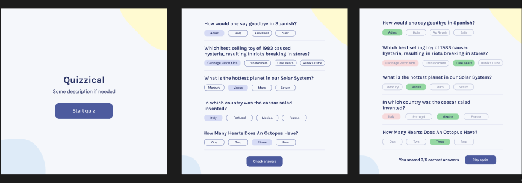

# Quizzical

> This is a trivia application that generates 5 random questions and scores the user on completion of the quiz.



It utilizes reacts Class components to function and implement its various features.

## Built With

- JavaScript

- CSS

- React
- JSX

## Live Demo

[Live Demo Link](https:///)

### Development (Running locally)

- Clone the project

```bash
git clone https://github.com/user/html-css-template.git

```

- Install Dependencies

```bash
npm install
```

To run StyleLint by itself, you may run the lint task:

```bash
npm run lint:check
```

Or to automatically fix issues found (where possible):

```bash
npm run lint
```

You can also check against Prettier:

```bash
npm run format:check
```

and to have it actually fix (to the best of its ability) any format issues, run:

```bash
npm run format
```

You can also check against HTML Validator:

```bash
npm run html-validator
```

## Style Guides

- [CSS Style Guide](http://udacity.github.io/frontend-nanodegree-styleguide/css.html)
- [HTML Style Guide](http://udacity.github.io/frontend-nanodegree-styleguide/index.html)
- [JavaScript Style Guide](http://udacity.github.io/frontend-nanodegree-styleguide/javascript.html)
- [Git Style Guide](https://udacity.github.io/git-styleguide/)

## 👤 Author

- Github: [@Lanr3waju]<https://github.com/Lanr3waju>)
- LinkedIn: [@Abass Olanrewaju](https://www.linkedin.com/in/lanr3waju/)
- Twitter: [@abdul-wasi-img](https://twitter.com/abdul_wasi_img)

## 🤝 Contributing

Contributions, issues and feature requests are welcome!

Feel free to check the [issues page](../../issues).

## Show your support

Give a ⭐️ if you like this project!

## Acknowledgments

- I appreciate the efforts of my tutor and mentors for their constatnt guidance and contribtution.
- [Bob Ziroll](http://linkedin.com/in/bobziroll)
- [Bola Buhari](http://github.com/bolah2009)
- [Adeleye Jamiu](https://github.com/adejam)

## 📝 License

[MIT licensed](./LICENSE).
